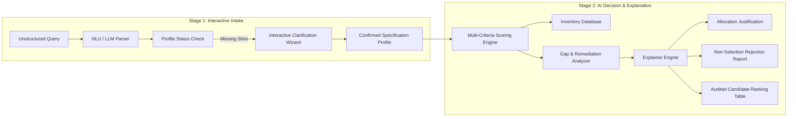

# AI-Powered Industrial Resource Allocation System

[](https://www.python.org/downloads/)
[](https://pytorch.org/)
[](https://huggingface.co/)
[](https://docs.pydantic.dev/)
[](https://opensource.org/licenses/MIT)

An intelligent, production-ready resource allocation system built for industrial plants, power utilities, and chemical processing facilities. The system takes natural language business queries, extracts structured technical constraints, performs deterministic multi-criteria matching against live inventory, provides executive allocation justifications, and produces exhaustive rejection/shortfall analyses for non-selected candidates.

---

## Table of Contents

1. [Executive Summary & System Workflow](#executive-summary--system-workflow)
2. [Architectural Design Decisions](#architectural-design-decisions)
   - [Q1: Why use LLM only for Extraction, not End-to-End Allocation?](#q1-why-use-llm-only-for-extraction-not-end-to-end-allocation)
   - [Q2: Why Fine-Tuning over RAG (Retrieval-Augmented Generation)?](#q2-why-fine-tuning-over-rag-retrieval-augmented-generation)
3. [Core Capabilities & Features](#core-capabilities--features)
4. [System Architecture](#system-architecture)
5. [Project Layout](#project-layout)
6. [Installation & Setup](#installation--setup)
7. [Running the Application](#running-the-application)
8. [Fine-Tuning Pipeline](#fine-tuning-pipeline)
9. [Evaluation Benchmark Scenarios](#evaluation-benchmark-scenarios)
10. [Domain Guardrails & Edge Cases](#domain-guardrails--edge-cases)

---

## Executive Summary & System Workflow

In industrial resource management, procurement managers and plant engineers specify equipment or personnel using domain-specific natural language (e.g., *"We need an urgent boiler for acid synthesis, 10 years vintage, throughput 5,000 L/day, budget 60k"*). 

This system bridges unstructured human intent with rigorous industrial compliance via a **Two-Stage Workflow**:



---

## Architectural Design Decisions

### Q1: Why use LLM only for Extraction, not End-to-End Allocation?

A common pitfall in GenAI applications is attempting to make the Large Language Model perform database searching, arithmetic comparison, and hard constraint filtering entirely in its prompt context. 

This project intentionally implements a **Hybrid Neuro-Symbolic Architecture**:

```
[ Natural Language Query ]
          │
          ▼
┌──────────────────────────────────────────────┐
│  LLM Layer (Probabilistic Reasoning)         │
│  - Natural Language Understanding (NLU)      │
│  - Domain entity & slot extraction           │
│  - Intent classification & disambiguation    │
└──────────────────────┬───────────────────────┘
                       │ Structured JSON Schema
                       ▼
┌──────────────────────────────────────────────┐
│  Deterministic Engine (Symbolic / Code)      │
│  - Exact mathematical arithmetic             │
│  - Real-time inventory state verification    │
│  - Multi-criteria weighted scoring matrix    │
│  - Hard industrial safety & chemical matrix  │
│  - Dimension-by-dimension gap detection      │
└──────────────────────────────────────────────┘
```

#### Detailed Comparison: Pure LLM vs. Hybrid Engine

| Evaluation Dimension | Pure LLM Approach (Prompting LLM with Catalog) | Hybrid Engine Approach (This Project) |
| :--- | :--- | :--- |
| **Arithmetic Precision** | ❌ **High failure rate.** LLMs are token predictors, not calculators. They frequently fail budget comparisons (`55,000 <= 50,000`) and capacity subtraction. | ✅ **100% Exact.** Python arithmetic computes exact budget savings/overruns, surplus experience, and capacity margins without rounding or math errors. |
| **Hallucination & Inventory Integrity** | ❌ **High risk.** LLMs can hallucinate non-existent serial numbers, misquote rental costs, or allocate equipment currently in maintenance. | ✅ **Zero Hallucination.** Only real assets present in `resources.json` / ERP database can ever be evaluated or allocated. |
| **Scalability ($O(N)$ vs Token Limit)** | ❌ **Fails at scale.** As catalog grows to 10,000+ items, prompt stuffing exceeds context windows, costs thousands in token bills, and suffers from *"lost-in-the-middle"* retrieval degradation. | ✅ **Instant Sub-millisecond Execution.** Relational/JSON filtering scales linearly and handles tens of thousands of items instantaneously on CPU. |
| **Auditability & Reproducibility** | ❌ **Non-deterministic.** Sampling temperature can cause different allocations for identical requirements across runs, violating industrial procurement audit standards. | ✅ **Fully Auditable & Deterministic.** Every score, weight, penalty, and trade-off is logged with clear mathematical provenance. |
| **Safety & Industrial Compliance** | ❌ **Dangerous.** Allocating equipment with unverified chemical compatibility (e.g., non-acid-rated boilers in acid lines) risks equipment failure or hazard. | ✅ **Hard Constraint Guardrails.** Automated chemical compatibility cross-checks prevent dangerous allocations. |

---

### Q2: Why Fine-Tuning over RAG (Retrieval-Augmented Generation)?

During architectural design, **Fine-Tuning (SFT / LoRA)** was selected over **RAG (Retrieval-Augmented Generation)** for the following technical and operational reasons:

```
┌─────────────────────────────────────────────────────────────────────────────────────────┐
│ WHY RAG IS THE WRONG ABSTRACTION FOR THIS TASK:                                         │
│ • RAG retrieves unstructured text chunks based on semantic cosine similarity.           │
│ • But resource allocation requires STRUCTURED PARAMETER FILTERING (e.g., cost <= 60000, │
│   experience >= 5, available == True, chemical IN ['Acids']).                           │
│ • Vector embeddings cannot compute relational inequalities (<=, >=, boolean AND/OR).    │
│ • If RAG retrieves candidate text, the LLM still has to do prompt-based math (unreliable).│
└─────────────────────────────────────────────────────────────────────────────────────────┘
```

#### Technical Comparison: Fine-Tuning vs. RAG

| Factor | Retrieval-Augmented Generation (RAG) | Fine-Tuned Small LLM (LoRA / SFT) (Used Here) |
| :--- | :--- | :--- |
| **Primary Purpose** | Grounding queries in external, unstructured static documents (PDFs, wikis, knowledge bases). | Specialized task adaptation: mapping variable natural language into a **strict JSON schema** ($f(\text{Text}) \rightarrow \text{JSON}$). |
| **Schema Reliability** | Frequent JSON parsing failures; requires complex retry parsers or expensive few-shot prompt stuffing. | High schema adherence learned directly during supervised instruction tuning. |
| **Latency & Overhead** | High latency: (1) Embedding generation + (2) Vector DB search + (3) Reranking + (4) Large context LLM generation (~1.5s - 4.0s). | Ultra-low latency: Lightweight single-pass forward inference (~50ms - 200ms). |
| **Edge / Local Deployability** | Requires vector database infrastructure, embedding models, and a large generative LLM. | Compact LoRA adapter (1.1B parameters, ~8MB adapter weights) runnable locally on CPU/laptops without GPU servers. |
| **Database Sync Overhead** | When inventory prices, availability, or maintenance dates update every minute, vector embeddings must be constantly re-indexed. | Zero re-indexing. Inventory changes in the SQL/JSON database take effect immediately without model retraining. |

---

## Core Capabilities & Features

### 1. Two-Stage Guided Requirement Intake
- **Profile Status Tracking:** Displays real-time status of required slots (Resource Type, Experience, Budget Ceiling, Water Throughput, Chemical Processes, Urgency).
- **Interactive Clarification Wizard:** Asks targeted follow-ups only for missing or ambiguous parameters before running the optimization engine.

### 2. Allocation Justification (`[3]`)
- Automatically details every satisfied condition: category match, experience surplus (+X years), budget savings (Rs. X saved), water throughput sufficiency, chemical compatibility certifications, and immediate availability.

### 3. Non-Selection & Rejection Analysis (`[4]`)
- Answers **why each non-selected candidate was rejected or passed over**:
  - Exact budget overruns (e.g., *Budget overrun by Rs. 12,000 (+20.0%)*).
  - Experience deficits (e.g., *Experience deficit of 2 yr(s) (Has 4 yrs vs 6 yrs req)*).
  - Maintenance/downtime blockers (e.g., *Currently unavailable until 2026-10-15*).
  - Capacity deficits (e.g., *Capacity deficit of 1,500 L/day*).
  - Chemical incompatibilities (e.g., *Incompatible / unverified for: Acids*).

### 4. Dimension-by-Dimension Gap Analysis (`[5]`)
- Classifies shortfalls by severity: `CRITICAL`, `MAJOR`, `MINOR`.
- Formulates actionable remediation strategies (e.g., *Pair with senior certified operator*, *Deploy auxiliary booster unit*, *Adjust budget ceiling*).

### 5. Domain Guardrails & Out-of-Domain Detection
- Detects conversational or irrelevant prompts (e.g., *"What is today's weather?"*, *"Tell me a joke"*), flags `OUT_OF_DOMAIN`, prevents false resource assignments, and guides the user back to valid industrial resource queries.

---

## System Architecture

```
                    ┌──────────────────────────────────────────────┐
                    │          User Natural Language Query         │
                    └──────────────────────┬───────────────────────┘
                                           │
                                           ▼
                    ┌──────────────────────────────────────────────┐
                    │               src/parser.py                  │
                    │  - HuggingFaceLLMParser (Cloud / LoRA)       │
                    │  - Deterministic Semantic Fallback Parser    │
                    │  - Out-of-Domain Guardrail Classifier        │
                    └──────────────────────┬───────────────────────┘
                                           │ ParsedRequirement
                                           ▼
                    ┌──────────────────────────────────────────────┐
                    │               src/matcher.py                 │
                    │  - Multi-Criteria Scoring (Type, Exp, Cost)  │
                    │  - Shortfall Reason Extraction               │
                    └──────────────┬───────────────────────────────┘
                                   │
                 ┌─────────────────┴─────────────────┐
                 ▼                                   ▼
┌─────────────────────────────────┐ ┌─────────────────────────────────┐
│      src/gap_analyzer.py        │ │        src/explainer.py         │
│  - Dimension gap detection      │ │  - Allocation justification     │
│  - Remediation formulations     │ │  - Non-selection breakdown      │
└────────────────┬────────────────┘ └────────────────┬────────────────┘
                 │                                   │
                 └─────────────────┬─────────────────┘
                                   ▼
                    ┌──────────────────────────────────────────────┐
                    │       AllocationResponse & CLI Display       │
                    └──────────────────────────────────────────────┘
```

---

## Project Layout

```
power-resource-allocation/
├── README.md                      # Comprehensive project documentation
├── requirements.txt               # Dependencies (Pydantic, Transformers, PEFT, PyTorch)
├── .env.example                   # Environment template for Hugging Face API tokens
├── resources.json                 # Industrial inventory catalog (Boilers, Chillers, Engineers)
├── training_data.jsonl            # 155 instruction-tuning prompt/completion pairs
├── fine_tune_pipeline.py          # Native PyTorch + LoRA SFT training script
├── resource_allocation.py         # Main runnable CLI application (Interactive & Demo)
└── src/
    ├── __init__.py                # Package initialization
    ├── models.py                  # Pydantic data schemas (ParsedRequirement, Evaluation, GapReport)
    ├── parser.py                  # Dual-engine NLU parser (HF LLM + Semantic Rule Parser)
    ├── matcher.py                 # Multi-criteria scoring and candidate evaluation engine
    ├── gap_analyzer.py            # Dimension-by-dimension gap detection & remediation
    └── explainer.py               # Natural language justification & non-selection synthesis
```

---

## Installation & Setup

### 1. Prerequisites
- Python 3.10, 3.11, or 3.12
- Git

### 2. Clone and Create Virtual Environment
```bash
# Clone the repository
git clone https://github.com/your-username/power-resource-allocation.git
cd power-resource-allocation

# Create virtual environment
python -m venv venv

# Activate virtual environment
# Windows (PowerShell):
.\venv\Scripts\Activate.ps1
# Linux / macOS:
source venv/bin/activate
```

### 3. Install Dependencies
```bash
pip install -r requirements.txt
```

### 4. Configure Environment Variables (Optional for Hugging Face Cloud API)
Create a `.env` file in the root directory:
```bash
cp .env.example .env
```
Add your Hugging Face User Access Token (from [Hugging Face Settings](https://huggingface.co/settings/tokens)):
```env
HF_TOKEN=hf_your_actual_token_here
HF_MODEL_NAME=TinyLlama/TinyLlama-1.1B-Chat-v1.0
```

---

## Running the Application

### 1. Interactive Mode (Recommended)
Launches the two-stage interactive intake wizard:
```bash
python resource_allocation.py -i
```

### 2. Automated Benchmark Scenarios (Demo Suite)
Runs pre-configured industrial test scenarios:
```bash
python resource_allocation.py --demo
```

### 3. Single Query Execution
Pass any natural language requirement directly via CLI:
```bash
python resource_allocation.py --query "I need a boiler with 5 years experience, budget Rs. 60,000, 5000 L/day water throughput for acid processing."
```

### 4. Running with Hugging Face Model
To route slot extraction through Hugging Face Serverless API or local fine-tuned weights:
```bash
python resource_allocation.py --use-hf --hf-model TinyLlama/TinyLlama-1.1B-Chat-v1.0
```

---

## Fine-Tuning Pipeline

The project includes a self-contained LoRA fine-tuning script (`fine_tune_pipeline.py`) designed for lightweight models (`TinyLlama/TinyLlama-1.1B-Chat-v1.0` or `Qwen/Qwen2.5-1.5B-Instruct`).

### Training Features:
- **Parameter-Efficient Fine-Tuning (PEFT / LoRA):** Trains low-rank adapters ($r=8, \alpha=16$) on attention projection layers (`q_proj`, `v_proj`, `k_proj`, `o_proj`), updating $< 1\%$ of parameters.
- **Native PyTorch Training Loop:** Multi-worker safe training loop fully compatible with Windows, macOS, and Linux without thread locking issues.
- **Custom Industrial Dataset:** 155 synthetic prompt-response pairs (`training_data.jsonl`) covering boilers, chillers, water treatment, consultants, and edge cases.

### Run Fine-Tuning:
```bash
python fine_tune_pipeline.py --model TinyLlama/TinyLlama-1.1B-Chat-v1.0 --epochs 3 --batch-size 2 --output ./fine_tuned_allocator
```

---

## Evaluation Benchmark Scenarios

The system is evaluated against 5 benchmark scenarios:

| # | Scenario Title | Input Query | Key Decision & Validation |
| :- | :--- | :--- | :--- |
| **1** | **Exact Match Allocation** | *"Need resources for a chemical project: 5000 L/day water, boiler with 5+ yrs exp, budget Rs. 60,000."* | Allocates **Industrial Steam Boiler (B001)**. Confirms budget savings (Rs. 5,000) and surplus experience (+3 yrs). Explains why B005 was rejected (Budget overrun). |
| **2** | **Partial Match with Gaps** | *"Need an industrial boiler with at least 15 years experience and budget Rs. 30,000."* | Flags `PARTIAL_MATCH_WITH_GAPS`. Details critical experience deficit (11 yrs) and minor budget overrun (Rs. 10k) on Vulcan Eco (B002). Recommends pairing with senior operator. |
| **3** | **Ambiguous / Incomplete Query** | *"I need a boiler for my chemical project."* | Identifies missing budget and experience constraints. Applies explicit operational assumptions and prompts clarification. |
| **4** | **Urgent Chemical Cooling** | *"Urgent requirement: Need industrial refrigerant chiller for ammonia cooling, budget Rs. 35,000, immediately available."* | Allocates **CryoMax R-717 (R001)**. Rejects R004 (budget overrun) and R002 (ammonia incompatibility). |
| **5** | **Consulting / Human Capital** | *"Experienced chemical process consultant with 8+ years experience in polymer synthesis, budget Rs. 80,000."* | Allocates **Senior Chemical Process Consultant (E001)** with 10 yrs experience and verified polymer synthesis certification. |

---

## Domain Guardrails & Edge Cases

### Out-of-Domain Query Handling
When a user provides an unrelated query (e.g., weather, sports, jokes, cooking recipes):
```powershell
python resource_allocation.py --query "What is today's weather?"
```
**Output:**
```text
======================================================================
       [!] OUT-OF-DOMAIN / UNRELATED QUERY DETECTED
======================================================================
Aggregated Query : "What is today's weather?"

The input query 'What is today's weather?' does not appear to be related 
to industrial resource allocation. This system specializes in allocating 
industrial equipment (Boilers, Refrigeration Chiller units, Water Treatment plants) 
and technical personnel (Chemical Process Consultants, Thermal Engineers). 
Please provide an industrial equipment, personnel, budget, or engineering requirement.
======================================================================
```

---

## Author & Submission Details

- **Author:** Jatin Dudhani
- **Project:** AI-Powered Resource Allocation System
- **Focus Areas:** Natural Language Understanding, Fine-Tuning (LoRA), Neuro-Symbolic AI, Multi-Criteria Optimization.
